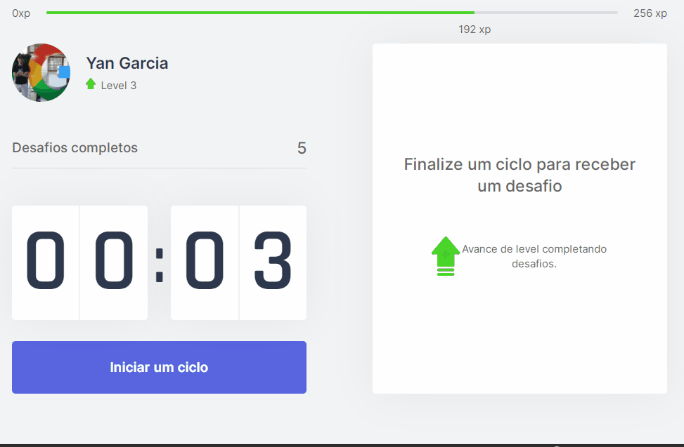

<h1 align="center">
    
</h1>

Obs: no gif acima, o ciclo foi setado em 3 segundos apenas para exibir, de forma rápida, o seu funcionamento. 
Na demonstração abaixo, o ciclo está setado em 25 minutos, para que você possa testar integralmente a aplicação.

<br />

<h3 align="center">
    <a href="https://move-doro.vercel.app/">Acessar a demonstração</a>
<h3 >

<br />

# Indice

- [Sobre](#-sobre)
- [Tecnologias Utilizadas](#-tecnologias-utilizadas)
- [Como baixar o projeto](#-como-baixar-o-projeto)

## 🔖 &nbsp; Sobre

O projeto **MoveDoro** se baseia no método podomoro, que tem por objetivo definir ciclos de trabalho de 25 minutos para que a pessoa se mantenha focado. Nesta aplicação, sugerimos alguns exercícios durante o intervalo entre os ciclos, visando o bem estar físico e mental da pessoa.
---

## 🚀 &nbsp; Tecnologias utilizadas

Esse projeto foi desenvolvido com as seguintes tecnologias:

- [Next](https://nextjs.org)
- [React](https://reactjs.org)
- [TypeScript](https://www.typescriptlang.org/)

---

##  📁 &nbsp; Como baixar o projeto

```bash

    # Clonar o repositório
    $ git clone https://github.com/yangvaz/MoveDoro

    # Entrar no diretório
    $ cd MoveDoro

    # Instalar as dependências
    $ yarn install

    # Iniciar o projeto
    $ yarn start
```

---

Desenvolvido por Yan Garcia 🥑 